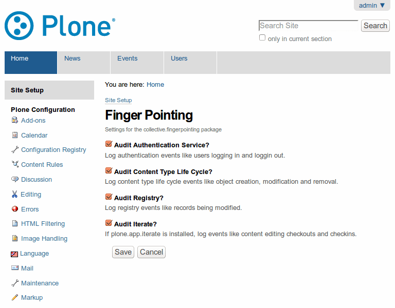

***************
Finger Pointing
***************

.. contents:: Table of Contents

Life, the Universe, and Everything
==================================

Keep track of different events and write them down to an audit log.

Mostly Harmless
===============

.. image:: https://secure.travis-ci.org/collective/collective.fingerpointing.png?branch=master
    :alt: Travis CI badge
    :target: http://travis-ci.org/collective/collective.fingerpointing

.. image:: https://coveralls.io/repos/collective/collective.fingerpointing/badge.png?branch=master
    :alt: Coveralls badge
    :target: https://coveralls.io/r/collective/collective.fingerpointing

.. image:: https://pypip.in/d/collective.fingerpointing/badge.png
    :alt: Downloads
    :target: https://pypi.python.org/pypi/collective.fingerpointing/

Got an idea? Found a bug? Let us know by `opening a support ticket`_.

.. _`opening a support ticket`: https://github.com/collective/collective.fingerpointing/issues

Don't Panic
===========

Installation
------------

To enable this package in a buildout-based installation:

#. Edit your buildout.cfg and add add the following to it::

    [buildout]
    ...
    eggs =
        collective.fingerpointing

After updating the configuration you need to run ''bin/buildout'', which will take care of updating your system.

Go to the 'Site Setup' page in a Plone site and click on the 'Add-ons' link.

Check the box next to ``collective.fingerpointing`` and click the 'Activate' button.

Usage
-----

Go to 'Site Setup' and select 'Finger Pointing' and enable the events you want to keep an eye on.

    The Finger Pointing control panel configlet.

Finger Pointing will start logging the selected events::

    # bin/instance fg
    2015-06-08 11:25:08 INFO ZServer HTTP server started at Mon Jun  8 11:25:08 2015
    Hostname: 0.0.0.0
    Port: 8080
    2015-06-08 11:25:17 INFO Zope Ready to handle requests
    2015-06-08 11:30:03 INFO collective.fingerpointing user=admin ip=127.0.0.1 action=logged out
    2015-06-08 11:30:15 INFO collective.fingerpointing user=admin ip=127.0.0.1 action=logged in
